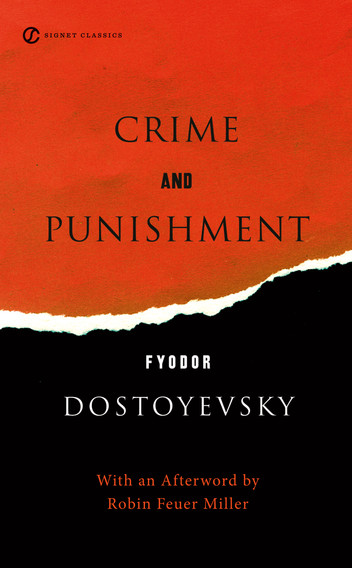

# Book Review: Crime and Punishment - Fyodor Dostoevsky

Fyodor Dostoevsky’s _Crime and Punishment_ is a dreary and sad book. The plot itself isn't necessarily a sad one, but its main character is, overwhelmingly so. There is little joy in this book, and any positive emotion is quickly sapped away by the melancholy of our protagonist, Raskolnikov. Raskolnikov is a student who, due to financial hardship, has to drop out of college temporarily. He conceives the idea that there are men on this earth who should not be forced to conform to the rules that apply to the average person. These men are destined for greatness, and the laws of society are merely suggestions to them. He believes he might just be one of these chosen few and plans a horrible crime to alleviate his poverty and, as a result, catapult himself into greatness. The problem with this plan is Raskolnikov’s own mental anguish. Even before committing the crime, he is tormented by his own sense of morality, and this only intensifies after the deed is done.

Fyodor Dostoevsky lived in Russia in the late 1800s and spent some years in a Siberian prison. He emerged as a devout follower of Christ, foregoing the ideas that led to his imprisonment. As such, this book (or at least the translation from the original Russian text) suffers a little from the writing style of the time. Lengthy monologues from characters ramble on and on, often losing my attention and forcing me to re-read sentences I had just seen a few seconds before. Often, I did not see the relevance of these speeches until perhaps the last few sentences, where the speaker finally makes an actual point. I believe this may be intentional, as sometimes the characters themselves recognize the pointlessness of the dialogue. However, intentional or not, it is still a slog to get through, and I do not look forward to re-reading bits of this book again.

The plot is fairly straightforward to follow. There aren’t too many characters to keep track of, but the main issue lies in their names. Characters are often known by two or sometimes three different names. For example, Dunia, Dunya, and Avdotia Romanovna all refer to the same person. We follow the mental and physical sufferings of Raskolnikov, his adventures in his feverish state, and the characters who either want to help him or seem to want to get rid of him. Characters like Luzhin, Razumikhin, and Porfiry Petrovich stand out from the rest, with scenes involving them almost always a joy to read.

_Crime and Punishment_ presents a wide array of characters. From drunkards to sly detectives to perverted rich benefactors, a lot of emotions are conveyed in this book. Primarily, you feel the gloom and sadness emanating from Raskolnikov, which certainly puts a damper on things. His emotions swing in wildly different directions much of the time, from assuredness in his own actions and beliefs to full mental breakdowns that render him incapable of moving for extended periods. You cannot help but feel sorrow when a mother, out of her mind in grief, beats her children in the streets and forces them to dance like monkeys just to prove a point to strangers. Crime and Punishment certainly does not hold back in showing just how badly poverty and disease can reduce a person to an unrecognizable caricature.

While not entirely new to me, I did appreciate the argument of there being a class of people who are above laws and, by extension, morality. What would we be willing to sacrifice as a species to advance in the future? Would we be willing to condemn millions to death if it meant solving cancer once and for all? Billions of people have already died in human history as a result of the decisions of a few, with most of these deaths serving no purpose other than to satiate the greed and entitlement of the elite. As Raskolnikov puts it, your actions are judged solely on whether you succeed or fail. Presently, we see the select few putting their interests above all others, regardless of the consequences and subsequent ramifications for the rest of the populace.

Overall, I think _Crime and Punishment_ is a decent book, allowing us to delve into the mind of a criminal and question the views society expects us to have. Regardless of the ending, or even what the book tells you is right or wrong, I believe we must decide for ourselves whether the ramifications of our actions should be enough to deter us from undertaking them.

**Rating**: ★★★☆☆
