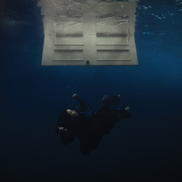
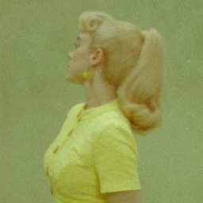
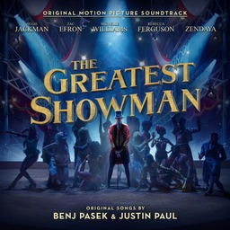

import { Image } from "astro:assets";
import theBatmanImage from "../../assets/the-batman-poster.jpg";
import bladeRunner2049Image from "../../assets/blade-runner-2049-poster.jpg";
import arcaneImage from "../../assets/arcane-s01-poster.jpg";
import childrenOfDuneImage from "../../assets/children-of-dune-cover.jpg"
import deadPoetsSocietyImage from "../../assets/dead-poets-society-poster.jpg"
import dunePartTwoImage from "../../assets/dune-part-two-poster.jpg"
import ritaHayworthImage from "../../assets/rita-hayworth-and-shawshank-redemption-cover.jpg"
import successionImage from "../../assets/succession-poster.jpg"
import theGirlWithDragonTattooImage from "../../assets/the-girl-with-the-dragon-tattoo-cover.jpg"
import theGreatestShowmanImage from "../../assets/the-greatest-showman-poster.jpg"

# 2024: The Media I Loved

2024 was a good year, with lots of really decent media being released. Below are the things I consumed that I believe are good enough to be shared. Note: not all of these were released in 2024. In fact, the majority of them were released in previous years. I’m just lazy and now catching up.

## Music

### _Hit Me Hard And Soft (album) - Billie Eilish (2024)_

I don’t really know how to describe this album. All I know is that this is Billie Eilish’s best work to date. _Wildflower_ is my favourite song, but all the songs on here show that Billie is growing as an artiste and is actually taking advantage of her amazing voice. Finneas’ songwriting and production is also on full display here, making them the best musical duo in the world currently in my opinion. I love almost every song on this album, with _Lunch_ being the only one that I don’t particularly care for. It’s my favourite album this year, and probably enters contention for my favourite album by any artiste _ever_.

### _What Was I Made For (song) - Billie Eilish (2023)_

There really isn’t anything I can say about the main theme for _Barbie (2023)_. It’s already won a Grammy award for Song of The Year. I only watched _Barbie_ this year (I know, I know). But this song stands out so much it’s amazing how good it is. It’s enough to put tears in anyone’s eyes.

### _The Greatest Show (song) - Multiple artistes (2017)_

An epic that fills you with the motivation to do anything you want. Who knew Wolverine could sing so well.

You can check out what I generally listen to here: <a href="https://open.spotify.com/playlist/1eVQeYBGES4Pd2ilNHSVaZ?si=DmO2pKNqTBi5OcptHA3kDg" target="_blank">Spotify Playlist</a>

## Movies

### _The Batman (2022)_

<Image src={theBatmanImage} width={256} alt="The Batman movie poster" />
Robert Pattinson sheds his sparkling diamond skin to emerge as an emo goth
cosplayer. This new (movie) take on Batman is very well done, with amazing
action, dialogue, setting, and music. Finally we get to see the Bat as an actual
detective on screen, figuring out answers to The Riddler’s schemes. This is in
my opinion, the best Batman movie we’ve seen (_The Dark Knight_ is a Joker
movie, let’s be real).

### _Blade Runner 2049 (2017)_

<Image src={bladeRunner2049Image} width={256} alt="Blade Runner 2049 movie poster" />
You should probably see _Blade Runner (1982)_ before this one, but this movie
stands on its own so well that you could choose not to, with Ryan Gosling
absolutely killing it in this role. It has happens to have <a href="https://youtu.be/pfrgOB_Mp1Y?si=iC9glDbZf8abZ3S5" target="_blank"> one of my favourite scenes in movie history.</a> Blade Runner 2049 questions our main character in an almost sadistic way,
finally revealing the truth to him in a way that evokes an immense amount of
sympathy. Fantastic movie, must watch.

### _Dune: Part Two (2024)_

<Image src={dunePartTwoImage} width={256} alt="Dune: Part Two movie poster" />
I’ll be honest here. I didn’t like _Dune: Part One_ very much. As a recent reader of the books, I felt it didn’t properly convey Frank Herbert’s writings as well as I wanted. It was also a movie with a bunch of A-list stars in it, and while they’re great actors, I believe some casting choices were made simply because of their popularity, rather than how well they fit with the role. But _Dune: Part Two_ actually surprised me. I really really liked this one. And no, it’s not because there was more action in this one. The visuals in this are amazing, the acting wonderful (I’m looking at you Austin Butler), but the music production by Hans Zimmer is just otherworldly. It really makes you feel you’re on a dystopian desert-world inhabited by arguably the greatest monsters in fiction.

### _The Greatest Showman (2017)_

<Image src={theGreatestShowmanImage} width={256} alt="The Greatest Showman movie poster" />
I don’t have much to say about this movie to be honest. The acting is fine, the music is good, the story is decent. But for some reason, this movie really resonated with me. I suppose the simple message of achieving your dreams and never giving up was presented in such a form that I couldn’t help but be inspired by it. It’s hard to describe the emotions this film managed to make me feel, so I just simply recommend you watch it if you haven’t already.

### _Dead Poets Society (1989)_

<Image src={deadPoetsSocietyImage} width={256} alt="Dead Poets Society movie poster" />
Finally I understand that random _Suits_ scene where Mike Ross says “O Captain. My Captain” to Harvey. Similar to _The Greatest Showman_, this movie inspires you to be who you want to be. Popularizing the Latin phrase “_Carpe diem_”, meaning “_Seize the day_”, Dead Poets Society is a classic that everyone should see. It’s funny, tragic, and most of all, liberating.

If you want to see what movies I’ve watched this year, take a look here: <a href="https://letterboxd.com/ftsenyo/films/diary/" target="_blank">Letterboxd diary</a>

## TV Shows

### _Arcane (2021)_

<Image src={arcaneImage} width={256} alt="Arcane Season 1 poster" />
I tried watching the first season of _Arcane_ when it came out in 2021, but abandoned it midway through the first episode for some reason. With the new season released this year, I decided to give it another go, and that was probably one of the better decisions I made this year. _Arcane_ is honestly the best animated show I’ve ever seen. The animation is absolutely phenomenal, with a unique art style that makes every single scene interesting to look at. The characters are beautifully flawed, with Silco and Jinx’s relationship being my personal highlight of the first season. The music is great – _‘Enemy’_ by Imagine Dragons is such a strong opening theme for this show. If you enjoy animation you’ll probably love _Arcane_. If you believe you’re too mature for anything that is animated, I’m sorry that you’ve chosen to deny yourself an amazing world of stories that are so beautifully captured in this medium.

### _Succession (2018)_

<Image src={successionImage} width={256} alt="Succession poster" />
I often wonder how HBO manages to consistently make such good shows, while other studios like Netflix flounder and cancel actual good TV in favour of the drivel that sees mass appeal (Yes I’m dramatic and hyperbolic. Sue me). _Succession_ is definitely one of the best shows I’ve ever seen. It enters my personal top shows alongside _The Wire_ and _Breaking Bad_. The soundtrack by Nicholas Britell is definitely worthy of other composers such as Ramin Djawadi and Hans Zimmer; so much so that Spotify tells me my top 5 songs this year were all from the _Succession_ soundtrack. But the characters, gods, the characters. Each of our main characters are written so well and yet so unlikeable you wonder why you’re even rooting for some of them. _Succession_ is the only show where I felt gloomy when reaching the end, and by the finale, I was actually trying to convince myself that there had to be more; the story couldn’t just end here. If you take anything at all away from this post, it’s this: **Watch Succession**.

## Books

### _Rita Hayworth and Shawshank Redemption - Stephen King (1982)_

<Image src={ritaHayworthImage} width={256} alt="Book cover for Rita Hayworth and Shawshank Redemption" />
You may have seen the movie, you may not have. But this book is definitely worth the read. It’s not long, the story is pretty simple, and the characters are few. It portrays a man of great patience, unflappable in the face of disaster, with the desire to accomplish the goal he’s set his mind to.

### _Children of Dune - Frank Herbert (1976)_

<Image src={childrenOfDuneImage} width={256} alt="ook cover for Children of Dune" />
Ah, _Dune_. The classic that inspires many science fiction stories today, and continues on through Frank Herbert’s son. I really like _Children of Dune_. The regular politicking of _Dune_ is, in my opinion, at its best in this story. I can’t really say much without spoiling the other _Dune_ books, so go read the first two books, _Dune_ and _Dune Messiah_, and then read this one.

### _The Girl With The Dragon Tattoo - Stieg Larsson (2005)_

<Image src={theGirlWithDragonTattooImage} width={256} alt="Book cover for The Girl With The Dragon Tattoo" />

The only hardcopy book I read this year, it was by chance I decided to pick this one up from the library in my house. Definitely not a book you’d want children reading; it is a dark story about attempts to solve a murder that happened many years in the past. There are graphic scenes of abuse and torture depicted, so if that isn’t your cup of tea then steer clear. I think Stieg Larsson has created a decent story here, and I’m considering reading the other books in this series.

<a href="https://www.goodreads.com/user_challenges/53827330" target="_blank">Here are the books I've read this year.</a>

## Bonus: YouTube

I watched _a lot_ of YouTube this year, and I find that a really good amount of good stuff is uploaded on there. So here are a few of my favourite videos from creators.

<iframe width="560" height="315" src="https://www.youtube.com/embed/NVGuFdX5guE?si=lyz7hbWH6mKEjzFh" title="YouTube video player" frameborder="0" allow="accelerometer; autoplay; clipboard-write; encrypted-media; gyroscope; picture-in-picture; web-share" referrerpolicy="strict-origin-when-cross-origin" allowfullscreen></iframe>

<iframe width="560" height="315" src="https://www.youtube.com/embed/g0UQgrFNExc?si=wq_SvrSV4HD10UEU" title="YouTube video player" frameborder="0" allow="accelerometer; autoplay; clipboard-write; encrypted-media; gyroscope; picture-in-picture; web-share" referrerpolicy="strict-origin-when-cross-origin" allowfullscreen></iframe>

<iframe width="560" height="315" src="https://www.youtube.com/embed/ymGt7I4Yn3k?si=RhlMFhCW8Bx0LgAi" title="YouTube video player" frameborder="0" allow="accelerometer; autoplay; clipboard-write; encrypted-media; gyroscope; picture-in-picture; web-share" referrerpolicy="strict-origin-when-cross-origin" allowfullscreen></iframe>

<iframe width="560" height="315" src="https://www.youtube.com/embed/4CaSXEEqKBU?si=PuCk0Q94rVqSSnhT" title="YouTube video player" frameborder="0" allow="accelerometer; autoplay; clipboard-write; encrypted-media; gyroscope; picture-in-picture; web-share" referrerpolicy="strict-origin-when-cross-origin" allowfullscreen></iframe>